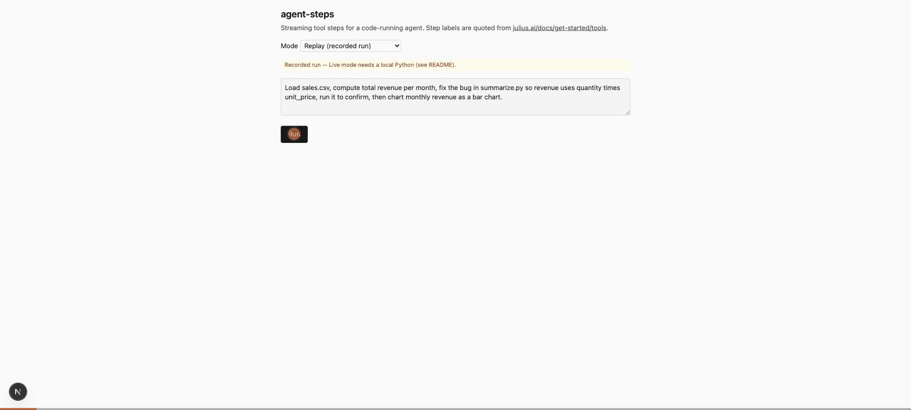

# agent-steps

A streaming "tool steps" UI kit for code-running agents: an agent streams typed step events over SSE and a React UI renders them as collapsible steps with code, a diff, and one interactive chart, with a measured before/after performance write-up.

## Why

The Julius product-engineer posting asks for "streaming UIs, and performance profiling" (https://www.workatastartup.com/jobs/93234), and Julius shows every step as a labeled tool call, "Generating code → Generated code", "Editing file → Edited file, with a diff", "Generating visualization → Generated visualization" (https://julius.ai/docs/get-started/tools). This repo is the step-streaming component I would want in that interface, built small enough to measure. The six labels above are quoted from that docs page; nothing else in Julius's UI is copied.

## Run it

```
npm install
npm run dev            # http://localhost:3117 — Replay mode plays a recorded run through the real pipeline
npm test               # unit tests; e2e: npx playwright install chromium && npx playwright test tests/e2e ; perf: npx playwright test tests/perf
```

Unit tests (`npm test`) and Live mode need a local `python3` (3.12+); the hosted replay demo needs none. Live mode (a real agent run) also needs `ANTHROPIC_API_KEY` in `.env.local` (copy `.env.example`) and `ALLOW_LIVE=1 npm run dev`. Record a new fixture with `npm run record -- <name>` while the live server runs. Inside the runner, `subprocess` and `os.system` are disabled and the working directory is on `sys.path`, so scripts can import `summarize.py`. The dev server uses port 3117 and the scripts set `NEXT_TELEMETRY_DISABLED=1`.

URL switches for the two optimizations: `?parser=buffered|streaming` and `?memo=off|on`; `?speed=N` scales replay timing.

## What was measured

Time-to-first-step, time-to-first-delta, and React Profiler commit count / render ms for the 2×2 grid {buffered, streaming parser} × {memo off, on}, produced by `npx playwright test tests/perf` (medians; details and definitions in `docs/perf.md`). The ~5.9 s common to every row is the recorded model's first-turn latency (its first token arrives 5.4 s into the run, after adaptive thinking) replayed as-is; the streaming parser only moves the step from the end of the tool-input stream to its start, about 300 ms for this 200-character script and proportional to code length. Each median is over 2 runs, so it is the mean of two; run `PERF_RUNS=4 npx playwright test tests/perf` for more.

## Left out on purpose

- Julius's look and feel, side panel, and Library; other step types (slides, images, video, web search, database queries); more than one artifact type.
- A hosted or shared code executor. The runner is a local `python3 -I` subprocess with a 10 s timeout, a 64 KiB output cap, CPU and file-size rlimits, sockets disabled, and `subprocess`/`ctypes`/`pip` imports blocked. It is a bounded guard, not a security sandbox, and Live mode is off unless `ALLOW_LIVE=1`. Julius runs code in cloud containers with dedicated CPU and RAM (https://julius.ai/docs/get-started/containers); this demo does not.
- The hosted demo is replay-only by design: the deployed page plays a recorded run with the prompt box disabled, and every live run happens on your machine.
- Package installs (`pip`), accounts, auth, persistence beyond one request, multi-turn chat history, a cancel button, a production profiling build.
- Cancelling a run: closing the page stops the stream to the browser, but a live model run continues on the server until it finishes or hits the 8-turn limit.

## Deploy

The Vercel deploy is replay-only: the server never runs Python there. Set no environment variables; `ALLOW_LIVE` stays unset, so the Live option is disabled and every run replays `fixtures/demo.json` (raw model events with their original timing) through the same route handler, agent loop, and UI as a live run. The route exports `maxDuration = 300` because a full-speed replay streams for the length of the recorded run (under 120 s) and the default function limit could cut it off; lower the number if your Vercel plan rejects it. The committed `fixtures/demo.json` is a 5-turn run (run_python, edit_file, run_python, make_chart; 89 streamed tool-input chunks) that replays in about 26 s at speed 1.

## Protocol

`POST /api/chat` streams `data: <json>\n\n` frames validated by zod (`lib/events.ts`): `step_started {stepId, tool, label}`, `step_delta {stepId, field: "code", text}`, `step_done {stepId, label, status, output, diff, durationMs}`, `chart {stepId, spec}`, plus `text_delta`, `done`, `error`. Tools: `run_python`, `edit_file`, `make_chart`. Tool results sent back to the model are capped at 8000 characters plus a short truncation marker. Model: `claude-sonnet-5` through `@anthropic-ai/sdk` with `eager_input_streaming` on every tool; the streaming parser (`lib/partial-json.ts`) turns each partial tool-input JSON chunk into visible code.

## Demo



## Performance (from docs/perf.md)

| parser | memo | time-to-first-step (ms) | time-to-first-delta (ms) | Profiler commits | Profiler render (ms) | events | total (ms) |
|---|---|---|---|---|---|---|---|
| buffered | off | 6174 | 6175 | 37 | 70 | 56 | 25877 |
| streaming | off | 5874 | 5878 | 46 | 76 | 67 | 25806 |
| buffered | on | 6107 | 6107 | 40 | 17 | 56 | 25815 |
| streaming | on | 5868 | 5873 | 48 | 22 | 67 | 25790 |

